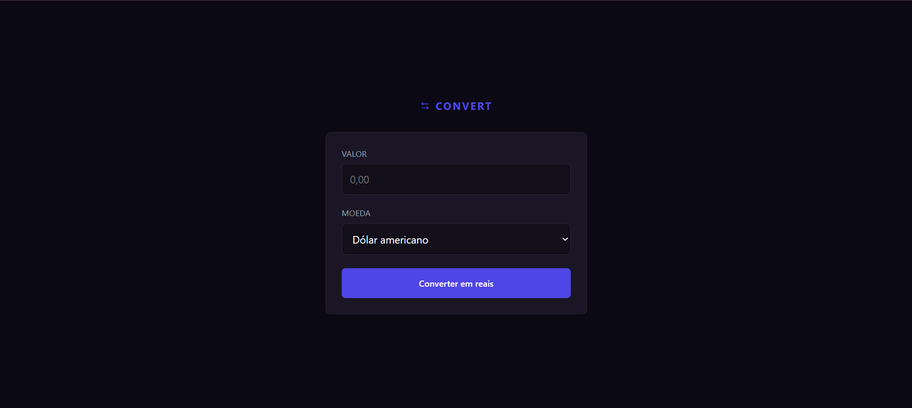

### 🌟 Introdução

* **Nome do Projeto:** Convert 💸
* **Evento ou Contexto:** Desenvolvido durante a trilha fundamental da **Rocketseat**, focado em consolidar conhecimentos de manipulação do DOM e lógica de programação com JavaScript.
* **Objetivo Principal:** Criar uma ferramenta utilitária que realiza a conversão de moedas (Dólar, Euro e Libra) para Real (BRL) em tempo real, utilizando taxas fixas para simular o processo de câmbio.
* **Detalhes Relevantes:** Este projeto destaca-se pela atenção à experiência do usuário, implementando validações de entrada (como permitir apenas números) e fornecendo um feedback visual imediato do resultado da conversão.

---

### 🚀 Principais Funcionalidades

O projeto é uma aplicação de página única (SPA) simples e eficiente:

1.  **Entrada de Valores:** Um campo de input que aceita apenas caracteres numéricos, facilitando a digitação do valor a ser convertido.
2.  **Seleção de Moeda:** Um menu suspenso (select) que permite escolher entre três moedas estrangeiras populares.
3.  **Cálculo Automático:** Ao clicar no botão de conversão, a aplicação processa o valor com base na cotação definida e exibe o resultado formatado.
4.  **Feedback Dinâmico:** Uma seção de resultado que aparece apenas após a conversão, exibindo o símbolo da moeda de destino (R$) e a cotação utilizada.
5.  **Formatação de Moeda:** Utiliza funções nativas do JavaScript para garantir que os valores apareçam no padrão monetário correto (ex: R$ 10,50).

---

### 🛠️ Tecnologias Utilizadas

* **HTML5:** Estruturação dos elementos da calculadora e da área de resultados. 🏗️
* **CSS3:** Estilização personalizada com foco em tipografia legível e um layout centralizado e limpo. 🎨
* **JavaScript (Vanilla):** Utilizado para capturar os eventos de formulário, aplicar Regex (Expressões Regulares) para validar o input e realizar os cálculos matemáticos. 🧠
* **Google Fonts:** Integração de fontes externas para elevar o nível do design visual. ✍️

---

### 📸 Aparência do Projeto

---

### 📚 Lições Aprendidas

As principais competências desenvolvidas neste projeto foram:
* **Manipulação de Eventos:** Uso do `addEventListener` para monitorar o envio do formulário e mudanças nos campos.
* **Regex (Expressões Regulares):** Implementação de filtros para impedir que o usuário digite letras no campo de valor.
* **Tratamento de Erros:** Criação de alertas visuais simples para garantir que a conversão ocorra apenas com dados válidos.
* **Organização de Funções:** Separação da lógica de cálculo da lógica de atualização da interface (UI).

---

### 🏁 Conclusão

O **Convert** reflete a importância de criar ferramentas que resolvam problemas cotidianos de forma elegante. O maior desafio foi garantir que a interface fosse "à prova de erros" do usuário, o que resultou em um aprendizado valioso sobre validação de dados. A conclusão deste projeto reforça a confiança na criação de aplicações JavaScript funcionais e prontas para o uso. ✨
